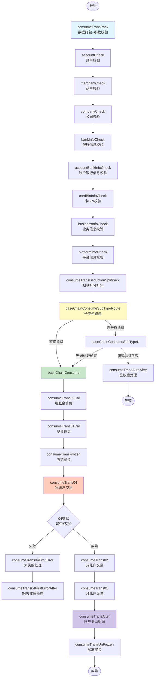
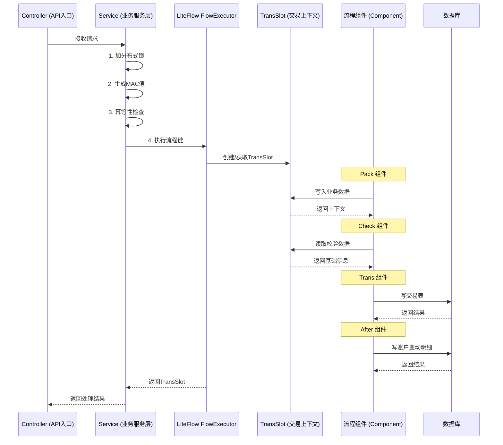
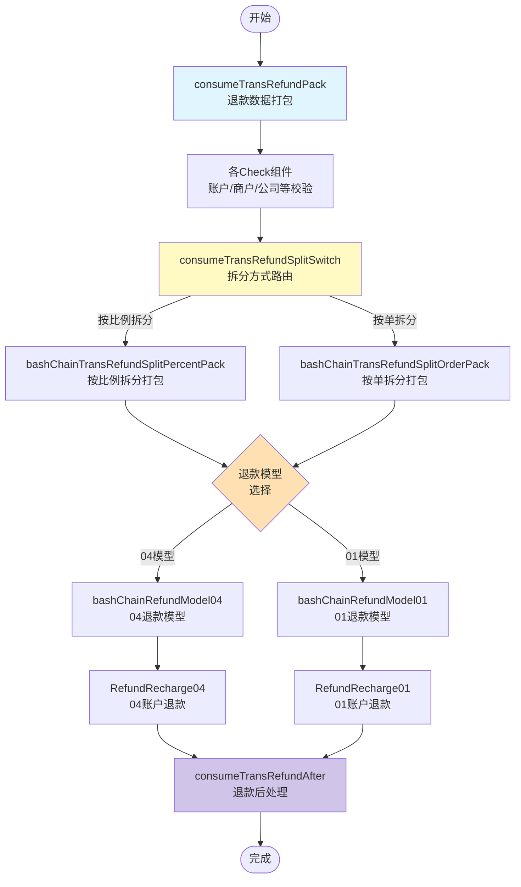
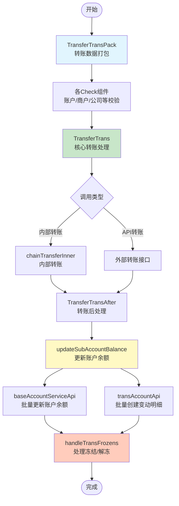
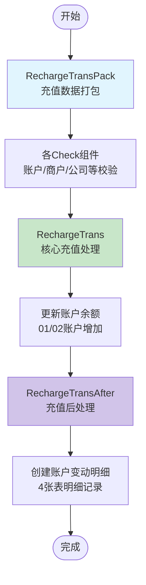
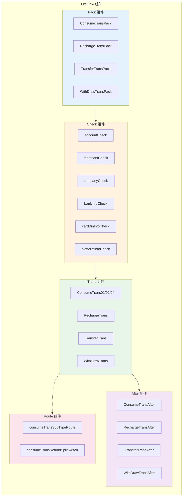
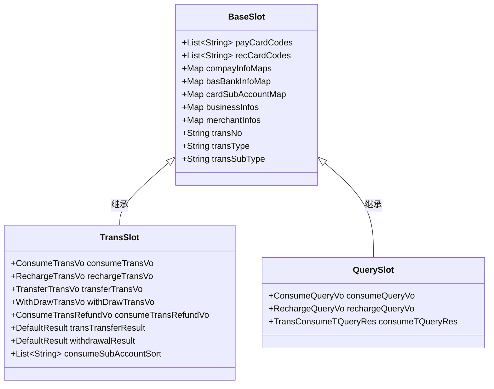

# 消费流程业务详细设计 - 流程图

本文档将消费流程的业务设计转换为可视化流程图。

---

## 一、消费链路完整流程图（chainConsume）

---

## 二、通用链路结构流程图（Pack → Check → Trans → After）

```mermaid
flowchart LR
    subgraph Pack["Pack（打包）"]
        P1[请求入参校验]
        P2[数据转换]
        P3[写入 Slot]
    end

    subgraph Check["Check（校验）"]
        C1[账户校验]
        C2[商户校验]
        C3[公司校验]
        C4[银行信息校验]
        C5[卡BIN校验]
        C6[平台信息校验]
    end

    subgraph Trans["Trans（执行）"]
        T1[路由选择]
        T2[核心交易处理]
        T3[写主表/子表]
        T4[调用外部接口]
    end

    subgraph After["After（后处理）"]
        A1[写账户变动明细]
        A2[更新汇总]
        A3[解冻资金]
    end

    Pack --> Check --> Trans --> After

    style Pack fill:#e3f2fd
    style Check fill:#fff3e0
    style Trans fill:#e8f5e9
    style After fill:#f3e5f5
```

---

## 三、业务处理模型图（Controller → 数据库）

---

## 四、消费退款链路流程图（chainConsumeRefund）

---

## 五、转账流程图（chainTransfer）

---

## 六、充值流程图（chainRecharge）

---

## 七、组件职责分类图

---

## 八、TransSlot 结构图

---

## 使用说明

以上流程图使用 **Mermaid** 语法编写，可以在以下工具中查看：

1. **VS Code** - 安装 "Mermaid Preview" 插件
2. **Typora** - 原生支持 Mermaid
3. **GitHub/GitLab** - 直接在 README 中渲染
4. **在线工具** - https://mermaid.live/

---

**文档生成时间**: 2026-02-27
**基于文档**: FRAMEWORK_STRUCTURE.md + 功能与LiteFlow介绍.md
